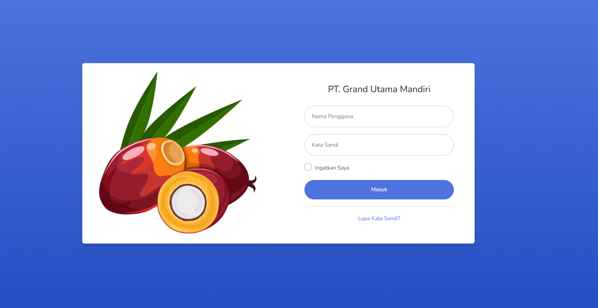
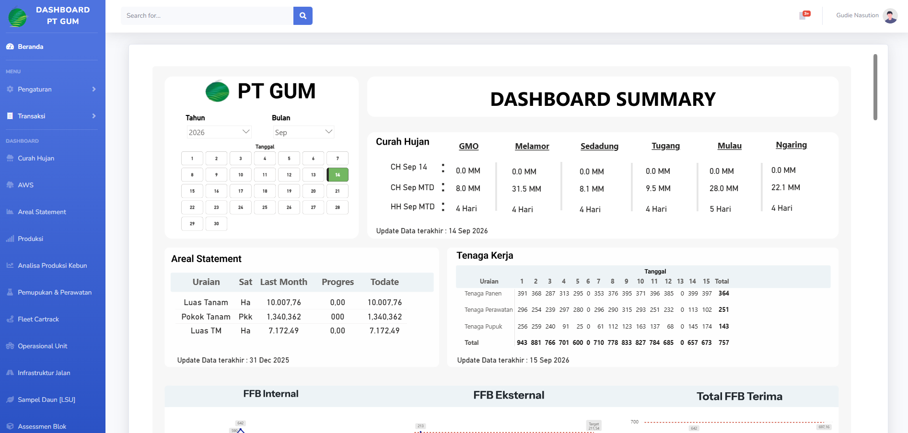

<h3> SMARTGUM APPLICATION </h3>

## Tentang SMARTGUM

Aplikasi ini merupakan web input data harian perkebunan kelapa sawit dan data kemudian di visualisasi kan kedalam bentuk dashboard yang didesin menggunakan Power BI.

Fitur:

- Data Harian Kebun (RKH;SPTB;RESTAN;REALISASI PANEN;PEMUPUKAN;PERAWATAN;PREMI).
- Areal Statement.
- Curah Hujan & AWS (Automatic Weather Station).
- Data Daily Production PKS (FFB Internal;FFB Eksternal;CPO;KERNEL;SALES).
- Data UpKeep Monthly.
- Laporan Harian Operator/Driver (LHO).
- Leaf Sampling Unit (LSU).

SMARTGUM masih sangat simple dan akan terus dilakukan pengembangan sesuai bisnis proses perkebunan kelapa sawit PT GUM

## Cara Pasang Aplikasi

Aplikasi menggunakan framework laravel 10 dan Postgresql, untuk proses setup aplikasi pastikan sudh memiliki web server baik berbasis linux dan windows
Langkah instalasi sebagai berikut :

- Git Clone App -> https://github.com/fithlail77/webdahsrevamp.git
- Composer Install
- npm install
- npm run  build
- setup database pada file .env
- php artisan key:generate
- php artisan serve

## Screnshoot App

## License

Aplikasi Web Dashboard Visualisasi PT GUM created by IT GUM [MGudieFithlailNst]
